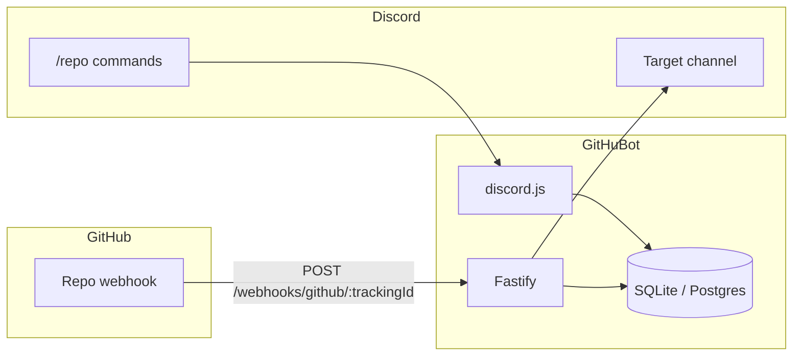

<h1 align="center">
  <a href="https://github.com/MatiDeZeta/GitHuBot">
    
  </a>
  <br>
  GitHuBot
</h1>

<p align="center">
  <a href="LICENSE"></a>
  <a href="https://nodejs.org/"></a>
  <a href="https://discord.js.org/"></a>
  <a href="https://pnpm.io/"></a>
</p>

<p align="center">
  Beautiful Discord changelog messages for GitHub activity — <strong>without giving the bot any GitHub credentials</strong>.
</p>

> Replaces GitHub’s default Discord webhook spam with branded [Components V2](https://docs.discord.com/developers/components/reference) messages for pushes, PRs, issues, releases, and more. You create the webhook yourself; the bot only *receives* and verifies signed deliveries.

> [**ⓘ**](#security) **Security:** there is no `GITHUB_TOKEN` in this project. A compromise of the host cannot leak or misuse GitHub write access, because none exists.

---

## Usage

1. Create a Discord application in the [Developer Portal](https://discord.com/developers/applications) and invite the bot with `applications.commands` + `bot` (Send Messages, View Channels).
2. Deploy GitHuBot (Railway / Docker / local) and set the [environment variables](#environment-variables).
3. Attach a **persistent volume** at `/app/data` if using SQLite (so tracked repos survive redeploys).
4. In Discord, run `/repo add repository:owner/repo channel:#changelog` (requires **Manage Server**).
5. Create the GitHub webhook from the ephemeral instructions (Payload URL + secret).
6. Push, open a PR, or publish a release — the changelog lands in your channel.

> [**ⓘ**](#slash-commands) Optional: set `DISCORD_ALLOWED_USER_ID` to lock `/repo` commands to a single Discord user ID.

<details>
<summary><strong>More information</strong></summary>

### Why GitHuBot?

GitHub’s built-in Discord integration dumps generic embeds. GitHuBot turns the same webhook stream into a clean changelog: accent colors, author avatars, commit lists, and link buttons — with a security model that never asks for a GitHub token.

### Features

1. **Zero GitHub credentials** — per-repo tracking ID + encrypted webhook secret
2. **Guided `/repo add`** — ephemeral setup steps for manual webhook creation
3. **Components V2 only** — no legacy embeds
4. **Per-repo event filters** — `/repo events`
5. **Signature verify + delivery dedupe** — `X-Hub-Signature-256` / `X-GitHub-Delivery`
6. **SQLite by default** — Railway/Docker volume; Postgres via `DATABASE_URL`
7. **Secret rotation** — `/repo regenerate-secret` with graceful cutover
8. **Rotating presence** — live tracked-repo / server counts plus branded Watching & Custom lines

### Architecture



### Slash commands

| Command | Description |
|---|---|
| `/repo add` | Track a repo; ephemeral webhook setup |
| `/repo remove` | Untrack (delete the GitHub webhook manually) |
| `/repo list` | List tracked repos |
| `/repo events` | Toggle event types |
| `/repo channel` | Change destination channel |
| `/repo webhook-info` | Re-show Payload URL + secret |
| `/repo regenerate-secret` | Rotate secret |

### Event coverage

| Event | Default |
|---|---|
| `push` | on |
| `pull_request` (incl. merged) | on |
| `issues` | on |
| `release` | on |
| `create` / `delete` | on |
| `issue_comment` / `pull_request_review` | off |
| `star` / `fork` | off |
| `workflow_run` | off |

### Tips

- Mount SQLite under `/app/data` on Railway — otherwise `/repo add` data is wiped on redeploy and old webhooks return `Unknown tracking id`.
- After `/repo add`, update or replace the GitHub webhook so the Payload URL matches the **current** tracking ID.
- Keep `MASTER_KEY` stable; changing it invalidates stored secrets (use `/repo regenerate-secret`).

</details>

---

## Getting started (development)

- [Node.js](https://nodejs.org/) 22+
- [pnpm](https://pnpm.io/) 11+
- Discord bot token (`DISCORD_TOKEN`) + application ID (`DISCORD_CLIENT_ID`)

```bash
cp .env.example .env
# fill DISCORD_TOKEN, DISCORD_CLIENT_ID, MASTER_KEY, PUBLIC_WEBHOOK_URL

node -e "console.log(require('crypto').randomBytes(32).toString('hex'))"  # MASTER_KEY

pnpm install
pnpm db:migrate
pnpm dev
```

### Environment variables

| Variable | Required | Description |
|---|---|---|
| `DISCORD_TOKEN` | yes* | Bot token |
| `DISCORD_CLIENT_ID` | yes* | Application ID |
| `MASTER_KEY` | yes* | 32-byte key (64 hex chars or base64) |
| `PUBLIC_WEBHOOK_URL` | yes* | Public base URL (`https://…` or bare host) |
| `DISCORD_GUILD_ID` | no | Register slash commands to one guild (faster in dev) |
| `DISCORD_ALLOWED_USER_ID` | no | Restrict `/repo` to one Discord user ID |
| `DATABASE_URL` | no | Default `file:/app/data/githubot.db` in Docker; local default `file:./data/githubot.db`; or `postgresql://…` |
| `PORT` / `HOST` | no | Default `3000` / `0.0.0.0` |
| `LOG_LEVEL` | no | Default `info` |

<sub>*Required for full Discord + webhook mode. Without them the process still serves `/health` (degraded boot).</sub>

**No `GITHUB_TOKEN`.** Do not add one.

---

## Run it yourself

* **Docker**

```bash
cp .env.example .env
# set PUBLIC_WEBHOOK_URL to your public URL
docker compose up -d --build
```

SQLite persists in the `githubot-data` volume.

* **Railway**

[](https://railway.com/new)

1. Deploy from this repo (`docker/Dockerfile` via `railway.json`)
2. Attach a volume at **`/app/data`**
3. Set `DATABASE_URL=file:/app/data/githubot.db` (required with the volume)
4. Set the other env vars from the table above
5. Set `PUBLIC_WEBHOOK_URL` to your Railway public domain

The image entrypoint `chown`s `/app/data` on boot so the non-root process can create SQLite files on Railway volumes.
* **Postgres** — set `DATABASE_URL=postgresql://…` (migrations under `drizzle/pg`)

---

<a id="security"></a>

## Security

GitHuBot is a **pure webhook receiver**. Secrets are generated locally, stored encrypted (AES-256-GCM), and never sent to GitHub by the bot. Signature checks use `X-Hub-Signature-256`; deliveries are deduped with `X-GitHub-Delivery`.

---

<sub>

MIT © [MatiDeZeta](https://github.com/MatiDeZeta) · [GitHuBot](https://github.com/MatiDeZeta/GitHuBot)

</sub>
