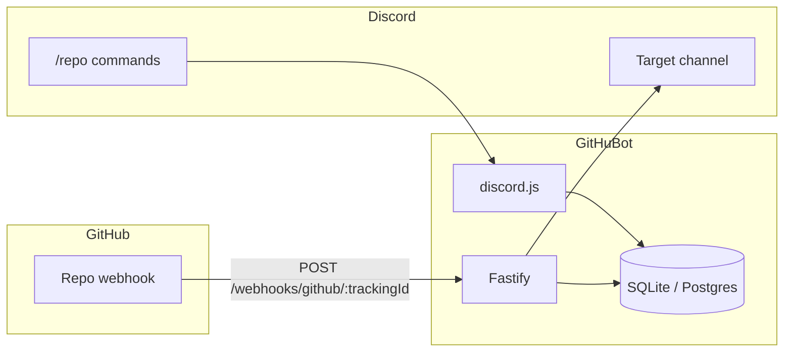

# GitHuBot

[](LICENSE)
[](https://nodejs.org/)
[](https://discord.js.org/)
[](https://pnpm.io/)

Beautiful Discord changelog messages for GitHub activity — **without giving the bot any GitHub credentials**.

GitHuBot replaces GitHub’s default Discord webhook spam with branded [Components V2](https://docs.discord.com/developers/components/reference) messages for pushes, PRs, issues, releases, and more. You create the GitHub webhook yourself; the bot only *receives* and verifies signed deliveries.

> **Security property:** there is no `GITHUB_TOKEN` in this project. A compromise of the host cannot leak or misuse GitHub write access, because none exists.

<!-- Screenshots / GIF placeholders -->
> **Screenshots:** add Components V2 message captures here after your first deploy.

## Features

- Zero GitHub credentials — per-repo tracking ID + encrypted webhook secret
- Guided `/repo add` flow with ephemeral setup instructions
- Components V2 design system (accent colors, avatars, link buttons — no embeds)
- Event filtering per repository (`/repo events`)
- Signature verification, delivery dedupe, webhook rate limiting
- SQLite by default (Railway volume / Docker volume); Postgres via `DATABASE_URL`
- One-click Railway deploy + docker-compose for any VPS

## Architecture



## Quick start

### 1. Create a Discord application

1. Open the [Discord Developer Portal](https://discord.com/developers/applications)
2. Create an application → Bot → copy the **token**
3. Copy the **Application ID** (Client ID)
4. Invite the bot with `applications.commands` + `bot` scopes and **Send Messages** / **View Channels** permissions

### 2. Configure environment

```bash
cp .env.example .env
```

Generate a master key:

```bash
node -e "console.log(require('crypto').randomBytes(32).toString('hex'))"
```

| Variable | Required | Description |
|---|---|---|
| `DISCORD_TOKEN` | yes | Bot token |
| `DISCORD_CLIENT_ID` | yes | Application ID |
| `DISCORD_GUILD_ID` | no | Register slash commands to one guild (faster in dev) |
| `MASTER_KEY` | yes | 32-byte key (64 hex chars or base64) for AES-256-GCM |
| `PUBLIC_WEBHOOK_URL` | yes | Public base URL, e.g. `https://your-app.up.railway.app` |
| `DATABASE_URL` | no | Default `file:./data/githubot.db`, or `postgresql://…` |
| `PORT` / `HOST` | no | Default `3000` / `0.0.0.0` |
| `LOG_LEVEL` | no | Default `info` |

**No `GITHUB_TOKEN`.** Do not add one.

### 3. Run locally

```bash
pnpm install
pnpm db:migrate
pnpm dev
```

### 4. Add a repository in Discord

```
/repo add repository:owner/repo channel:#changelog
```

Follow the ephemeral instructions to create a GitHub webhook pointing at:

`https://<your-domain>/webhooks/github/<trackingId>`

## Docker

```bash
cp .env.example .env
# fill env vars — set PUBLIC_WEBHOOK_URL to your public URL
docker compose up -d --build
```

SQLite data persists in the `githubot-data` volume.

## Railway

[](https://railway.com/template)

1. Deploy from this repo (Dockerfile at `docker/Dockerfile` via `railway.json`)
2. Attach a **volume** mounted at `/app/data`
3. Set environment variables from the table above (`DATABASE_URL=file:./data/githubot.db`)
4. Set `PUBLIC_WEBHOOK_URL` to your Railway public domain

## Slash commands

| Command | Description |
|---|---|
| `/repo add` | Track a repo; returns webhook setup steps |
| `/repo remove` | Untrack (delete GitHub webhook manually) |
| `/repo list` | List tracked repos |
| `/repo events` | Toggle event types |
| `/repo channel` | Change destination channel |
| `/repo webhook-info` | Re-show Payload URL + secret (ephemeral) |
| `/repo regenerate-secret` | Rotate secret |

Requires **Manage Server**.

## Event coverage

| Event | Default |
|---|---|
| `push` | on |
| `pull_request` (incl. merged) | on |
| `issues` | on |
| `release` | on |
| `create` / `delete` | on |
| `issue_comment` / `pull_request_review` | off |
| `star` / `fork` | off |
| `workflow_run` | off |

## Postgres

Set `DATABASE_URL` to a Postgres connection string (`postgresql://…`). Schema and migrations live under `drizzle/pg`. SQLite remains the recommended default for single-server deployments.

## License

[MIT](LICENSE)
