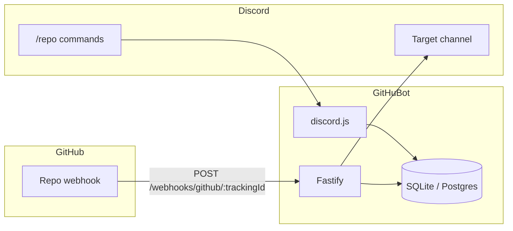
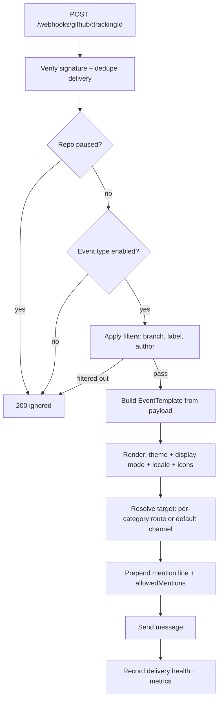

<h1 align="center">
  <a href="https://github.com/MatiDeZeta/GitHuBot">
    
  </a>
  <br>
  GitHuBot
</h1>

<p align="center">
  <a href="LICENSE"></a>
  <a href="CHANGELOG.md"></a>
  <a href="https://nodejs.org/"></a>
  <a href="https://discord.js.org/"></a>
  <a href="https://pnpm.io/"></a>
</p>

<p align="center">
  Beautiful Discord changelog messages for GitHub activity — <strong>without giving the bot any GitHub credentials</strong>.
</p>

> Replaces GitHub’s default Discord webhook spam with branded [Components V2](https://docs.discord.com/developers/components/reference) messages across **42 event types**. You create the webhook yourself; the bot only *receives* and verifies signed deliveries.

> [**ⓘ**](#security) **Security:** there is no `GITHUB_TOKEN` in this project. A compromise of the host cannot leak or misuse GitHub write access, because none exists.

---

## Usage

1. Create a Discord application in the [Developer Portal](https://discord.com/developers/applications) and invite the bot with `applications.commands` + `bot` (Send Messages, View Channels).
2. Deploy GitHuBot (Railway / Docker / local) and set the [environment variables](#environment-variables).
3. Attach a **persistent volume** at `/app/data` if using SQLite (so tracked repos survive redeploys).
4. In Discord, run `/repo add repository:owner/repo channel:#changelog` (requires **Manage Server**).
5. Create the GitHub webhook from the ephemeral instructions (Payload URL + secret), content type `application/json`, **Send me everything**.
6. Run `/repo test owner/repo` to confirm the channel works, then `/repo events owner/repo` to choose what gets posted.

> [**ⓘ**](#slash-commands) Optional: set `DISCORD_ALLOWED_USER_ID` to lock `/repo` commands to a single Discord user ID.

<details>
<summary><strong>More information</strong></summary>

### Why GitHuBot?

GitHub’s built-in Discord integration dumps generic embeds. GitHuBot turns the same webhook stream into a clean changelog: accent colors, author avatars, commit lists, labelled fields and link buttons — with a security model that never asks for a GitHub token.

### Features

1. **Zero GitHub credentials** — per-repo tracking ID + encrypted webhook secret
2. **42 event types** in nine categories, toggled through a two-step picker
3. **Components V2 only** — no legacy embeds
4. **Themes and density** — five palettes, detailed or compact
5. **Filters, routing and mentions** — branch/label/author rules, per-category channels, role pings
6. **Pause, test and health** — operate a repo without touching GitHub
7. **Signature verify + delivery dedupe** — `X-Hub-Signature-256` / `X-GitHub-Delivery`
8. **SQLite by default** — Railway/Docker volume; Postgres via `DATABASE_URL`
9. **Secret rotation** — `/repo regenerate-secret` with graceful cutover
10. **Metrics-driven presence** and a `/stats` command

### Architecture


```mermaid
flowchart LR
  subgraph discord [Discord]
    Slash["/repo commands"]
    Channel[Target channel]
  end
  subgraph app [GitHuBot]
    Bot[discord.js]
    Fastify[Fastify]
    DB[(SQLite / Postgres)]
  end
  subgraph github [GitHub]
    Hook[Repo webhook]
  end
  Slash --> Bot
  Bot --> DB
  Hook -->|"POST /webhooks/github/:trackingId"| Fastify
  Fastify --> DB
  Fastify --> Channel
```

### Delivery pipeline


```mermaid
flowchart TD
    hook["POST /webhooks/github/:trackingId"] --> verify["Verify signature + dedupe delivery"]
    verify --> paused{"Repo paused?"}
    paused -->|yes| skip["200 ignored"]
    paused -->|no| enabled{"Event type enabled?"}
    enabled -->|no| skip
    enabled -->|yes| filters["Apply filters: branch, label, author"]
    filters -->|filtered out| skip
    filters -->|pass| build["Build EventTemplate from payload"]
    build --> render["Render: theme + display mode + locale + icons"]
    render --> route["Resolve target: per-category route or default channel"]
    route --> mentions["Prepend mention line + allowedMentions"]
    mentions --> send["Send message"]
    send --> health["Record delivery health + metrics"]
```

</details>

---

## Slash commands

| Command | Description |
|---|---|
| `/repo add` | Track a repo; ephemeral webhook setup instructions |
| `/repo remove` | Untrack (delete the GitHub webhook manually) |
| `/repo list` | Tracked repos with pause state, routes, filters, last delivery |
| `/repo events` | Two-step category picker with presets |
| `/repo channel` | Change the default destination channel |
| `/repo route` | Send one category to a different channel |
| `/repo mentions` | Ping a role for one category |
| `/repo filters` | Branch / label / author rules (modal) |
| `/repo style` | Theme and display density |
| `/repo pause` · `/repo resume` | Mute without touching GitHub |
| `/repo test` | Post a sample message to verify setup |
| `/repo health` | Delivery counters and the last error |
| `/repo webhook-info` | Re-show Payload URL + secret |
| `/repo regenerate-secret` | Rotate the secret with a grace period |
| `/repo language` | Set this server's language |
| `/help` | Setup, events, filters, appearance, troubleshooting |
| `/stats` | Uptime, counters, latency, busiest repos |
| `/about` · `/ping` | Version info and latency |

Every `repository` option autocompletes from the repos tracked in that server.

---

## Event catalog

Defaults are marked ●. Everything else is opt-in through `/repo events`.

| Category | Events |
|---|---|
| **Code** | `push` ● · `create` ● · `delete` ● · `commit_comment` |
| **Pull requests** | `pull_request` ● · `pull_request_review` · `pull_request_review_comment` · `pull_request_review_thread` |
| **Issues** | `issues` ● · `issue_comment` · `label` · `milestone` |
| **CI/CD** | `workflow_run` · `workflow_job` · `check_run` · `check_suite` · `status` · `deployment` · `deployment_status` |
| **Releases** | `release` ● · `package` · `registry_package` |
| **Discussions** | `discussion` · `discussion_comment` |
| **Security** | `dependabot_alert` · `code_scanning_alert` · `secret_scanning_alert` · `secret_scanning_alert_location` · `security_advisory` · `branch_protection_rule` · `branch_protection_configuration` |
| **Community** | `fork` · `star` · `sponsorship` · `member` · `public` |
| **Repository & meta** | `repository` · `gollum` · `projects_v2_item` · `deploy_key` · `meta` · `page_build` |

Presets in the picker: **Minimal** (`push`, `release`), **Standard** (the six defaults), **Everything**, **Disable all**.

Some events are intentionally quiet even when enabled: successful workflow jobs, check runs and check suites are skipped because the workflow-level result already covers them, and `pending` commit statuses never post.

---

## Filters, routing and mentions

**Filters** — `/repo filters owner/repo` opens a modal:

| Field | Behaviour |
|---|---|
| Only these branches | Glob allow-list (`main`, `release/*`). Empty means all. |
| Never these branches | Glob deny-list, evaluated first. |
| Only these labels | Applies only to events that carry labels (issues, PRs and their comments). |
| Ignore these authors | Logins or globs. The literal `bot` drops every bot account. |

Branch rules apply to any event whose payload names a branch: pushes, branch/tag events, pull requests, workflow and check events, deployments and code scanning alerts.

**Routing** — `/repo route owner/repo category:cicd channel:#builds` sends that whole category elsewhere. Text, announcement, thread, forum and media channels all work; forum and media channels get one post per event. Omit `channel` to clear the route.

**Mentions** — `/repo mentions owner/repo category:security role:@secops` prepends a ping line and scopes `allowedMentions` to exactly that role.

---

## Appearance

**Themes** — `/repo style owner/repo theme:<id>`

| Theme | Look |
|---|---|
| `default` | Balanced, saturated accents |
| `github` | Mirrors GitHub's own state colors |
| `neon` | High saturation, tuned for dark themes |
| `mono` | Single neutral grey |
| `language` | Accent from the repository's primary language |

**Density** — `/repo style owner/repo mode:<detailed\|compact>`. Detailed shows avatars, quoted bodies, labelled fields, media galleries and relative timestamps; compact is one line plus link buttons.

**Icons** — every glyph is a Unicode default. Override any of them with custom application emojis:

```
EMOJI_OVERRIDES={"push":"<:push:123456789012345678>","merged":"<:merged:123456789012345678>"}
```

Keys are icon names (`push`, `merged`, `failure`, `star`, `shield`, …). Unknown keys are logged and ignored.

---

## Presence

Discord ignores `assets`, `party`, `timestamps`, `buttons` and `secrets` for **bot** presences — only `name`, `type`, `state` and `url` are honored, so there is no true Rich Presence for bots. GitHuBot instead rotates text driven by live metrics.

```
PRESENCE_ROTATION=[{"type":"watching","name":"{repos} repos"},{"type":"custom","name":"Custom Status","state":"{events} events today"}]
PRESENCE_STREAM_URL=https://twitch.tv/yourchannel
```

Placeholders: `{repos}` `{servers}` `{events}` `{uptime}` `{ping}` `{version}`.
Types: `playing` `streaming` `listening` `watching` `competing` `custom`.
The Streaming activity is skipped unless `PRESENCE_STREAM_URL` points at Twitch or YouTube — the only hosts Discord renders the purple badge for.

---

## Translations

All user-facing text lives in `src/i18n/locales/en.ts` as a flat, typed catalog. English is the only language shipped in 1.1.0, but the infrastructure is complete.

To add one:

1. Create `src/i18n/locales/<code>.ts` exporting a `Partial` of the English catalog. Missing keys fall back to English, so a partial translation is fine.
2. Add `<code>` to `SUPPORTED_LOCALES` and register it in `CATALOGS` in `src/i18n/index.ts`.
3. Map the relevant Discord locale codes to it in `DISCORD_LOCALE_MAP`; command name and description localizations are generated from there automatically.

Servers choose their language with `/repo language`. Resolution order is guild setting → the requester's Discord locale → `DEFAULT_LOCALE`.

---

## Getting started (development)

- [Node.js](https://nodejs.org/) 22+
- [pnpm](https://pnpm.io/) 11+
- Discord bot token (`DISCORD_TOKEN`) + application ID (`DISCORD_CLIENT_ID`)

```bash
cp .env.example .env
# fill DISCORD_TOKEN, DISCORD_CLIENT_ID, MASTER_KEY, PUBLIC_WEBHOOK_URL

node -e "console.log(require('crypto').randomBytes(32).toString('hex'))"  # MASTER_KEY

pnpm install
pnpm db:migrate
pnpm dev
```

### Environment variables

| Variable | Required | Description |
|---|---|---|
| `DISCORD_TOKEN` | yes* | Bot token |
| `DISCORD_CLIENT_ID` | yes* | Application ID |
| `MASTER_KEY` | yes* | 32-byte key (64 hex chars or base64) |
| `PUBLIC_WEBHOOK_URL` | yes* | Public base URL (`https://…` or bare host) |
| `DISCORD_GUILD_ID` | no | Register slash commands to one guild (faster in dev) |
| `DISCORD_ALLOWED_USER_ID` | no | Restrict `/repo` to one Discord user ID |
| `DATABASE_URL` | no | Default `file:/app/data/githubot.db` in Docker; local default `file:./data/githubot.db`; or `postgresql://…` |
| `PORT` / `HOST` | no | Default `3000` / `0.0.0.0` |
| `LOG_LEVEL` | no | Default `info` |
| `DEFAULT_THEME` | no | `default` · `github` · `neon` · `mono` · `language` |
| `DEFAULT_DISPLAY_MODE` | no | `detailed` (default) or `compact` |
| `DEFAULT_LOCALE` | no | Default `en` |
| `EMOJI_OVERRIDES` | no | JSON map of icon key → custom emoji |
| `PRESENCE_STREAM_URL` | no | Twitch/YouTube URL enabling the Streaming activity |
| `PRESENCE_ROTATION` | no | JSON array replacing the built-in presence lineup |

<sub>*Required for full Discord + webhook mode. Without them the process still serves `/health` (degraded boot).</sub>

Malformed JSON in `EMOJI_OVERRIDES` or `PRESENCE_ROTATION` is treated as unset rather than fatal.

**No `GITHUB_TOKEN`.** Do not add one.

### HTTP endpoints

| Route | Purpose |
|---|---|
| `GET /health` | Liveness plus which required env vars are missing |
| `GET /metrics` | In-process delivery counters as JSON |
| `POST /webhooks/github/:trackingId` | Signed GitHub deliveries |

---

## Run it yourself

* **Docker**

```bash
cp .env.example .env
# set PUBLIC_WEBHOOK_URL to your public URL
docker compose up -d --build
```

SQLite persists in the `githubot-data` volume.

* **Railway**

[](https://railway.com/new)

1. Deploy from this repo (`docker/Dockerfile` via `railway.json`)
2. Attach a volume at **`/app/data`**
3. Set `DATABASE_URL=file:/app/data/githubot.db` (required with the volume)
4. Set the other env vars from the table above
5. Set `PUBLIC_WEBHOOK_URL` to your Railway public domain

The image entrypoint `chown`s `/app/data` on boot so the non-root process can create SQLite files on Railway volumes.

* **Postgres** — set `DATABASE_URL=postgresql://…` (migrations under `drizzle/pg`)

---

## Upgrading to 1.1.0

Deploy and restart. Migration `0002_v110` runs automatically and every new column is nullable or defaulted, so existing tracked repositories keep their channel, event selection and secrets. No new environment variables are required.

See [`CHANGELOG.md`](CHANGELOG.md) and [`RELEASE_NOTES_v1.1.0.md`](RELEASE_NOTES_v1.1.0.md) for the full list.

---

## Troubleshooting

| Symptom | Fix |
|---|---|
| Nothing arrives | Check **Recent Deliveries** on the GitHub webhook page, then `/repo health` |
| `401` on deliveries | Secret mismatch — run `/repo regenerate-secret` and update GitHub |
| `404` on deliveries | Stale Payload URL — re-copy it from `/repo webhook-info` |
| Message never posts | Bot needs **View Channel** and **Send Messages**; `/repo test` will surface the exact error |
| Data lost on redeploy | Mount SQLite under `/app/data` and set `DATABASE_URL` to match |
| Secrets stopped working | `MASTER_KEY` changed — rotate with `/repo regenerate-secret` |

---

<a id="security"></a>

## Security

GitHuBot is a **pure webhook receiver**. Secrets are generated locally, stored encrypted (AES-256-GCM), and never sent to GitHub by the bot. Signature checks use `X-Hub-Signature-256`; deliveries are deduped with `X-GitHub-Delivery`. Untrusted GitHub text is escaped and quoted before rendering, and role pings are scoped with `allowedMentions` so a commit message cannot trigger one.

---

<sub>

MIT © [MatiDeZeta](https://github.com/MatiDeZeta) · [GitHuBot](https://github.com/MatiDeZeta/GitHuBot)

</sub>
